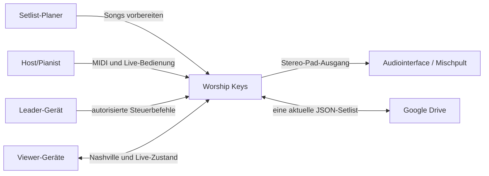
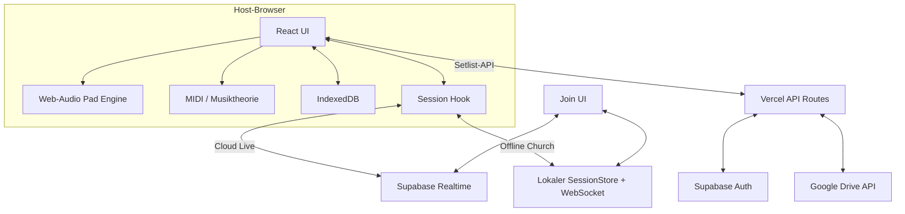
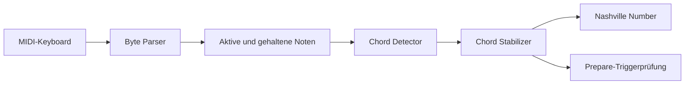
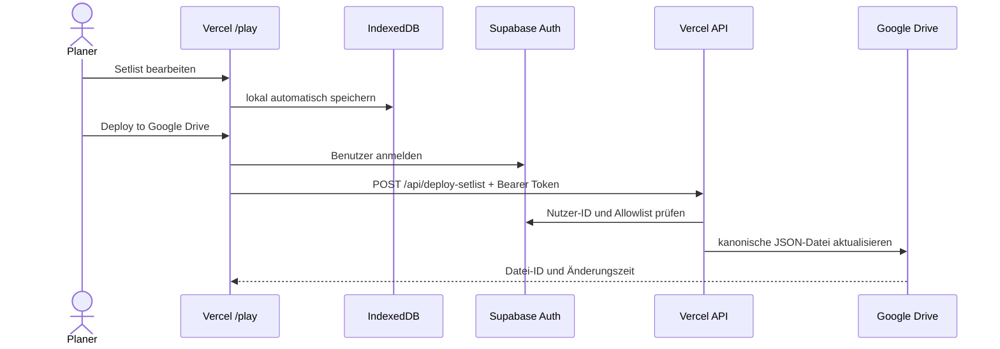
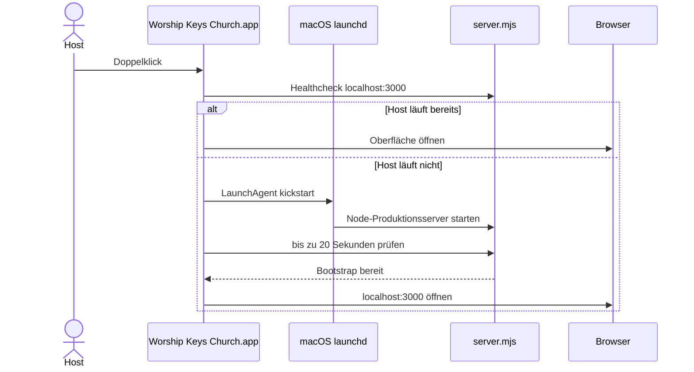
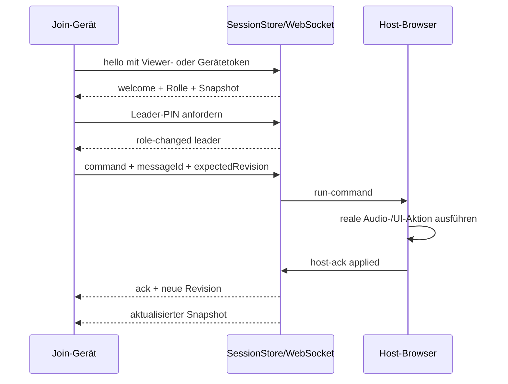
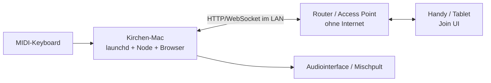

# Worship Keys – arc42-Architekturdokumentation

Stand: 3. August 2026

Repository: `ahaz6/worship-keys`

Produktivsystem: [worship-keys-psi.vercel.app](https://worship-keys-psi.vercel.app)

Diese Dokumentation beschreibt den aktuellen Stand von Worship Keys nach der
Einführung der Vercel-Web-App, des Google-Drive-Setlist-Transfers, der Cloud-Live-
Session und des vollständig lokalen Offline-Church-Modus.

## 1. Einführung und Ziele

### 1.1 Aufgabenstellung

Worship Keys ist ein Live-Instrument und Leitungswerkzeug für Lobpreis- und
Soaking-Situationen. Es verbindet warme Ambient-Pads mit Web MIDI,
Akkorderkennung, Nashville Numbers, Setlists und einer Join-Oberfläche für
weitere Musiker.

Die Anwendung muss zwei Nutzungssituationen abdecken:

1. Vorbereitung zu Hause über eine öffentliche Web-App mit Drive-Übergabe.
2. Zuverlässiger Live-Betrieb in der Gemeinde – auch in einem lokalen Netzwerk
   ohne Internetverbindung.

### 1.2 Qualitätsziele

| Priorität | Qualitätsziel | Mess- oder Prüfkriterium |
| --- | --- | --- |
| 1 | Live-Zuverlässigkeit | Pad-Audio läuft trotz Ausfall von Internet oder Join-Netz weiter. |
| 2 | Musikalisch weiche Übergänge | Equal-Power-Crossfades ohne hörbares Lautstärkeloch. |
| 3 | Bedienbarkeit | Wesentliche Live-Aktionen sind direkt und auf Host sowie Leader sichtbar. |
| 4 | Offline-Fähigkeit | Lokaler Host, Pads, Setlist und Join funktionieren ohne Vercel/Supabase. |
| 5 | Korrekte Musiktheorie | Nashville-Ausgabe, Transposition und Akkorderkennung sind automatisiert getestet. |
| 6 | Sicherheit | Viewer können keine Host-/Leader-Kommandos fälschen; Geheimnisse bleiben serverseitig. |
| 7 | Transparenz | Browsergrenzen bei MIDI, Audioausgang und Mikrofon werden ehrlich angezeigt. |

### 1.3 Stakeholder

| Stakeholder | Erwartung |
| --- | --- |
| Pianist/Host | Stabile Pads, MIDI, Nashville, Setlist und zentrale Kontrolle. |
| Worship-Leader | Schneller Song-/Tonartwechsel sowie Fade- und Crescendo-Steuerung. |
| Musiker/Viewer | Gut lesbare Nashville-Zahlen und aktuelle Songinformationen. |
| Setlist-Planer | Vorbereitung auf Handy oder Computer und sichere Übergabe an den Mac. |
| Tontechnik | Vorhersagbarer Stereoausgang ohne versteckte Pegel- oder Routingbehauptungen. |
| Betreiber/Entwickler | Reproduzierbare Builds, Tests, Diagnose und kontrollierte Geheimnisse. |

## 2. Randbedingungen

### 2.1 Technische Randbedingungen

- Next.js 16 mit App Router, React 19 und TypeScript.
- Node.js mindestens 22.13; `server.mjs` importiert TypeScript mit nativem Type
  Stripping.
- Web MIDI primär in Chromium-basierten Desktopbrowsern.
- Web Audio bleibt im Host-Browser; Audiodaten werden nicht an Join-Geräte
  gestreamt.
- Vercel unterstützt keinen dauerhaften projektspezifischen WebSocket-Server.
  Deshalb verwendet Cloud Live Supabase Realtime und Offline Church einen
  lokalen Node-/WebSocket-Prozess.
- macOS dient als vorgesehener Church-Host.
- Die App muss auch an einem Router ohne Internet funktionieren.

### 2.2 Organisatorische Randbedingungen

- Eine einzige kanonische Drive-Datei dient als Übergabepunkt.
- Der Kirchen-Mac soll kein Google-Servicekonto und keinen privaten Schlüssel
  besitzen.
- Das finale Sound-Wall-Material ist das einzige sichtbare Pad-Pack.
- Änderungen werden direkt über `main` veröffentlicht und auf Vercel deployed.

### 2.3 Konventionen

- Musik-, MIDI- und Audioalgorithmen bleiben außerhalb von React-Komponenten.
- Persistierte und übertragene Daten werden mit Zod validiert.
- Zustandsänderungen folgen Host-Autorität und Revisionsprüfung.
- UI-Zustände besitzen neben Farbe immer Text und zugängliche Beschriftungen.

## 3. Kontextabgrenzung

### 3.1 Fachlicher Kontext

### 3.2 Technischer Kontext

| Nachbarsystem | Schnittstelle | Zweck |
| --- | --- | --- |
| Browser | Web Audio, Web MIDI, IndexedDB, MediaDevices | Instrument, Geräte und lokale Persistenz. |
| Vercel | HTTPS/Next.js | Öffentliche `/play`-, `/join`- und API-Auslieferung. |
| Supabase Auth | HTTPS | Anmeldung und Prüfung berechtigter Drive-Nutzer. |
| Supabase Realtime | WebSocket/Broadcast | Cloud-Live-Zustände und Kommandos. |
| Google Drive API | OAuth2-Servicekonto/HTTPS | Lesen und Aktualisieren der kanonischen Setlist-Datei. |
| Lokales Gemeindenetz | HTTP + WebSocket | Offline-Join zwischen Mac und Musikergeräten. |
| macOS launchd | LaunchAgent | Dauerhafter lokaler Host ohne Terminalfenster. |

## 4. Lösungsstrategie

Die Architektur folgt fünf Leitideen:

1. **Audio bleibt lokal am Host.** Dadurch ist der Klang unabhängig von
   Netzwerkqualität und Latenz der Join-Geräte.
2. **Ein UI, zwei Live-Transporte.** Derselbe React-Session-Hook verwendet in
   Vercel Supabase Realtime und im Offline-Modus das lokale WebSocket-Protokoll.
3. **Cloud zur Vorbereitung, LAN zur Aufführung.** Drive/Vercel werden vor dem
   Gottesdienst genutzt; die Live-Ausführung besitzt keine Cloud-Abhängigkeit.
4. **Validierte Zustände.** Setlists, Session-Nachrichten und Einstellungen
   passieren Zod-Schemas und Versionsmigrationen.
5. **Getrennte Audioparameter.** Lautstärke, Fade, Crescendo und Key-Crossfade
   verwenden separate Gain-Stufen und überschreiben sich nicht gegenseitig.

## 5. Bausteinsicht

### 5.1 Ebene 1 – Gesamtsystem

### 5.2 Ebene 2 – Quellcodebausteine

| Bereich | Verantwortung |
| --- | --- |
| `app/` | Next-Seiten, API-Routen und Host-Orchestrierung. |
| `components/` | Präsentations- und Interaktionskomponenten. |
| `lib/audio/` | Laden der WAVs, Audiograph, Fades und Crossfades. |
| `lib/midi/` | Web-MIDI-Zugriff, Nachrichtenparser und aktive Noten. |
| `lib/music/` | Pitch, Akkorderkennung, Stabilisierung, Nashville, Schreibweise. |
| `lib/transitions/` | Zustandsmaschine für Prepare, Crescendo und Wechsel. |
| `lib/session/` | Protokoll, Rollen, Cloud-/LAN-Transport und Autorisierung. |
| `lib/storage/` | IndexedDB, Zod-Schema, Migration und Setlist-Operationen. |
| `lib/google-drive/` | Servicekonto, Drive-Upload/-Download und Mac-Lesetoken. |
| `lib/supabase/` | Browserclient und serverseitige Authentifizierung. |
| `scripts/` | Pad-Aufbereitung, Icon-Erzeugung und Church-App-Installation. |
| `server.mjs` | Lokaler Next-HTTP-Host, Session-APIs und WebSocket-Upgrade. |

### 5.3 Audio Engine

Der Pad-Graph besitzt getrennte Kontrollpfade:

- `volumeGain`: Main Volume,
- `fadeGain`: Fade in/Fade out,
- `crescendoGain`: Crescendo-Hüllkurve,
- `keyGain` pro Stimme: Equal-Power-Crossfade,
- Filter/Shimmer/Width: Klangbearbeitung ohne Änderung der Grundtonhöhe.

Der Shimmer verwendet nach Möglichkeit einen AudioWorklet-basierten granularen
Oktavierer. Ohne AudioWorklet fällt er transparent auf einen gefilterten
Reverb-Send zurück. Pad Motion verändert niemals `playbackRate`; Tonhöhe und
Loopdauer bleiben stabil.

### 5.4 Musik- und MIDI-Pipeline

Tiefe Noten erhalten bei der Grundtonbestimmung mehr Gewicht als hohe
Melodienoten. Input-Transpose wird nur auf MIDI angewendet; die Konzerttonart
ist die einzige Transposition des Pad-Sounds.

### 5.5 Persistenz und Datenschema

Der aktuelle persistierte Zustand hat `schemaVersion: 1` und umfasst:

- Setlist-ID, Name, Datum, Songs und aktiven Song,
- je Song Titel, Künstler, Konzerttonart, Modus, Taktart, BPM und Pad-Angaben,
- Präferenzen wie Notation, Voice-Sprache, Live-Modus und MIDI-Transpose.

Primärspeicher ist die IndexedDB `worship-keys`, Store `state`, Schlüssel
`current`. Die Supabase-Tabelle `worship_key_sets` mit Row-Level-Security ist
vorbereitet, aber noch nicht die primäre Setlist-Bibliothek des Produkts.

## 6. Laufzeitsicht

### 6.1 Vorbereitung und Drive-Übergabe

### 6.2 Import auf dem Kirchen-Mac

1. Der lokale Mac ruft `/api/open-setlist-from-drive` auf.
2. Ohne lokales Servicekonto leitet die Route die Anfrage an Vercel weiter.
3. Der eingeschränkte Keychain-Lesetoken authentifiziert den Kirchen-Mac.
4. Vercel lädt die eine kanonische Datei über das Servicekonto.
5. Das Ergebnis wird migriert und validiert.
6. Der Browser speichert es in IndexedDB; anschließend ist Internet entbehrlich.

### 6.3 Start des Offline-Church-Modus

`server.mjs` bindet bewusst an `0.0.0.0`, wählt bevorzugt eine physische private
IPv4-Adresse und erzeugt daraus den lokalen Join-Link. HTTP, SessionStore und
WebSocket liegen in einem Prozess, damit sie denselben autoritativen Zustand
verwenden.

### 6.4 Lokaler Join und Leader-Kommando

Absolute Faderwerte dürfen unabhängig von einer alten Revision gesetzt werden.
Semantische Aktionen werden bei veralteter Sicht abgewiesen und neu
synchronisiert. Automationstelemetrie verändert die Kommandorevision nicht.

### 6.5 Song- und Tonartwechsel

Bei einem Songwechsel bleibt der Sound-Wall-Mixer dienstweit stabil. Tonart und
BPM sind songbezogen; Main Volume, Tone, Shimmer, Brightness, Width und
Fade-Zeiten werden nicht zurückgesetzt. Der Pad-Wechsel verwendet auch bei
gleichem WAV-Asset zwei unabhängige Stimmen und einen Equal-Power-Crossfade.

## 7. Verteilungssicht

### 7.1 Cloud-Betrieb

| Knoten | Artefakte/Prozesse |
| --- | --- |
| Vercel | Next.js-Seiten, statische Pad-WAVs, Drive- und QR-API-Routen. |
| Host-Browser | React, Web Audio, Web MIDI, IndexedDB, Cloud-Session-Autorität. |
| Supabase | Auth und Realtime Broadcast. |
| Google Cloud/Drive | Servicekonto und aktuelle JSON-Setlist. |
| Join-Browser | `/join`, Realtime-Client, Viewer-/Leader-Oberfläche. |

### 7.2 Offline-Church-Betrieb

Installierte Pfade:

- App: `~/Applications/Worship Keys Church.app`
- LaunchAgent: `~/Library/LaunchAgents/app.worshipkeys.church.host.plist`
- Log: `~/Library/Logs/Worship Keys/church-host.log`
- Projekt und Build: aktuelles Repository mit `.next/BUILD_ID`

## 8. Querschnittliche Konzepte

### 8.1 Sicherheit

- Host-Bootstrap und PIN-Rotation sind nur über Loopback erreichbar.
- Viewer-/Leader-/Host-Rechte werden serverseitig geprüft.
- Sessiontokens werden kryptografisch zufällig erzeugt.
- Leader-PINs werden im lokalen SessionStore nur gehasht gehalten.
- `messageId` verhindert doppelte Befehlsausführung.
- `expectedRevision` schützt vor veralteten Änderungen.
- Drive-Deploy verlangt Supabase-Authentifizierung und eine Nutzer-Allowlist.
- Google-Private-Key bleibt als Vercel-Secret serverseitig.
- Der Mac erhält nur einen zeitvergleichssicher geprüften Lesetoken aus dem
  macOS-Schlüsselbund.
- Öffentliche oder bösartige LAN-Ziele werden durch eine Endpoint-Allowlist
  abgewiesen.

### 8.2 Offline-Fähigkeit

Der Live-Pfad im Offline-Church-Modus besteht nur aus lokalem Build, Pad-Dateien,
IndexedDB, Node, WebSocket und LAN. Drive, Vercel und Supabase sind explizit
nicht Teil dieses Pfads. Ein Internet- oder Cloud-Ausfall darf deshalb das
laufende Audio nicht beeinflussen.

### 8.3 Konsistenz

- Der Host ist die einzige Autorität für den tatsächlich hörbaren Zustand.
- Leader senden Wünsche; der Zustand wird erst nach Host-Acknowledge verändert.
- Snapshots sind Zod-validiert und enthalten eine monotone Revision.
- Faderautomation wird als Telemetrie gesendet, ohne semantische Revisionen zu
  verbrauchen.

### 8.4 Fehlerbehandlung und Diagnose

- Ungültige Setlists werden nicht teilweise geladen.
- Nicht unterstützte Browserfunktionen werden als ehrlicher Fallback angezeigt.
- Sessionfehler liefern verständliche Ablehnungsgründe.
- Church-Host-Start und Serverausgaben landen in einer festen Logdatei.
- Die UI zeigt einen Readiness-Status für Host, IP, Setlist und Pads.

### 8.5 Teststrategie

- Vitest für Musiktheorie, MIDI, Audio-Kurven, Transitionen, Persistenz und
  Session-Sicherheit.
- Pad-Asset-Test für alle zwölf Tonarten und Loop-Nähte.
- Playwright für Host, Setlist, Cloud-Session und LAN-Join.
- Offline-Audit prüft, dass lokaler Host und Join keine externen Browseranfragen
  auslösen.
- Aktueller Referenzstand: 162 Vitest-Tests in 11 Dateien und 7 E2E-Flows.

## 9. Architekturentscheidungen

| ID | Entscheidung | Begründung | Konsequenz |
| --- | --- | --- | --- |
| ADR-01 | Audio ausschließlich im Host-Browser | Minimale Latenz und Netzunabhängigkeit. | Join-Geräte hören kein eigenes Pad-Audio. |
| ADR-02 | Supabase Broadcast für Cloud Live | Vercel hostet keinen dauerhaften projektspezifischen Socket. | Cloud Join benötigt Internet. |
| ADR-03 | Eigener Node-/WS-Host für Offline Church | Vollständig lokaler Betrieb und eine SessionStore-Instanz. | Lokaler Prozess und Port 3000 erforderlich. |
| ADR-04 | Eine kanonische Drive-Datei | Einfacher Handy-zu-Mac-Transfer ohne Versionsauswahl. | Keine historische Setlist-Bibliothek. |
| ADR-05 | Drive-Schreibschlüssel nur auf Vercel | Begrenzung des Schadens bei Mac-Verlust. | Offline-Import muss vor dem Gottesdienst erfolgen. |
| ADR-06 | IndexedDB als primärer lokaler Speicher | Offline, schnell, ohne Benutzerkonto nutzbar. | Daten sind zunächst browser-/profilgebunden. |
| ADR-07 | Sound Wall Pads als einziges Pack | Klare, konsistente Worship-Klangidentität. | Keine Auswahl alter Presets. |
| ADR-08 | Playback-Rate bleibt 1.0 | Natürliche Tonhöhe und Loopdauer. | Motion entsteht durch Filter, Pan und Shimmer. |
| ADR-09 | Getrennte Gain-Stufen | Fader und Transitionen beeinflussen sich nicht destruktiv. | Komplexerer Audiograph, aber vorhersagbares Verhalten. |
| ADR-10 | launchd für den Church-Host | App reagiert sofort und Dienst überlebt den Launcher. | Installationsskript richtet einen Benutzer-LaunchAgent ein. |
| ADR-11 | Host-Acknowledge vor Zustandsfortschritt | Join-UI darf keine nicht ausgeführte Audioaktion behaupten. | Kommandos besitzen Timeout und Ablehnungsfall. |

## 10. Qualitätsanforderungen

| Szenario | Auslöser | Erwartete Reaktion |
| --- | --- | --- |
| Q-01 | Internet fällt im Gottesdienst aus. | Pad, MIDI, Host-UI und lokaler Join bleiben funktionsfähig. |
| Q-02 | WLAN zwischen Join und Mac fällt aus. | Audio spielt weiter; Join synchronisiert nach Rückkehr neu. |
| Q-03 | Leader sendet veralteten Songwechsel. | Server lehnt ab und sendet aktuellen Snapshot. |
| Q-04 | Viewer fälscht ein Leader-Kommando. | Serverseitige Rollenprüfung verweigert die Aktion. |
| Q-05 | Neue Tonart wird gewählt. | Weicher Equal-Power-Crossfade ohne Lautstärkeloch. |
| Q-06 | Song wechselt bei gleichem Pad-Asset. | Zwei unabhängige Stimmen crossfaden trotzdem. |
| Q-07 | Setlist-JSON ist beschädigt oder zu neu. | Validierung verweigert Import, vorhandene Setlist bleibt erhalten. |
| Q-08 | Mehrere Netzwerkinterfaces sind aktiv. | Physische private Schnittstelle wird bevorzugt; manuelles Override bleibt möglich. |
| Q-09 | App wird doppelt geöffnet. | Laufender Healthcheck wird erkannt und nur der Browser geöffnet. |
| Q-10 | Shimmer-Worklet fehlt. | Kontrollierter Reverb-Fallback mit sichtbarem Hinweis. |

## 11. Risiken und technische Schulden

| Risiko/Schuld | Auswirkung | Gegenmaßnahme oder nächster Schritt |
| --- | --- | --- |
| Kein Service Worker für vollständige Cloud-PWA-Offline-Nutzung | Erster Vercel-Aufruf benötigt Internet. | Lokale Church-App bleibt verbindlicher Offline-Weg. |
| Setlists sind primär browserlokal | Handy und Mac teilen Daten nicht automatisch. | Drive-Übergabe; später versionierte Supabase-Setlist-Bibliothek. |
| Web MIDI ist browserabhängig | Safari/Firefox können Keyboard nicht vollständig nutzen. | Chrome als Primärbrowser dokumentieren. |
| Keine Hardware-in-the-loop-Tests | USB-/Audiointerfaces können sich anders verhalten. | Vor-Ort-Testplan mit realem MIDI und Mischpult ergänzen. |
| Lokales HTTP statt HTTPS | Bestimmte Browserberechtigungen können eingeschränkt sein. | Optional vertrauenswürdiges lokales Zertifikat evaluieren. |
| Gastnetz/Client-Isolation | Join-Geräte erreichen den Host nicht. | Dedizierten Access Point und gemeinsames Subnetz verwenden. |
| LaunchAgent referenziert Projekt- und Node-Pfad | Verschieben/Löschen des Projekts bricht Start. | Installer erneut ausführen oder später eigenständiges signiertes Bundle bauen. |
| Supabase-E-Mail-Autoconfirm | Adressen sind nicht verifiziert. | Eigenes SMTP und E-Mail-Verifikation vor öffentlicher Registrierung. |
| Keine Drive-Historie | Fehlbedienung überschreibt die aktuelle Datei. | Später versionierte Setlist-Bibliothek oder Drive-Versionierung nutzen. |

## 12. Glossar

| Begriff | Bedeutung |
| --- | --- |
| Host | Mac/Browser, der Audio und autoritativen Live-Zustand erzeugt. |
| Leader | Autorisiertes Join-Gerät mit Fernsteuerungsrechten. |
| Viewer | Join-Gerät mit reiner Anzeige. |
| Offline Church Mode | Lokaler Node-/WebSocket-Betrieb ohne Cloud-Abhängigkeit. |
| Cloud Live | Vercel-Host mit Supabase-Realtime-Transport. |
| Sound Wall Pads | Finales, neutrales 12-Tonarten-Pad-Pack ohne Terz. |
| Prepared Key | Vorgemerkte Zieltonart für einen musikalischen Übergang. |
| Crescendo | Temporäre Steigerung von Klangweite und Helligkeit mit Rückkehr zum Ausgangswert. |
| Nashville Number | Akkordstufe relativ zur aktuellen Konzerttonart. |
| Canonical Drive File | Einzige aktuelle JSON-Datei für den Handy-zu-Mac-Transfer. |
| Snapshot | Vollständige, validierte Sicht auf den Live-Zustand. |
| Revision | Monotone Versionsnummer semantischer Sessionänderungen. |
| LaunchAgent | macOS-Hintergrunddienst, der den lokalen Church-Host verwaltet. |
